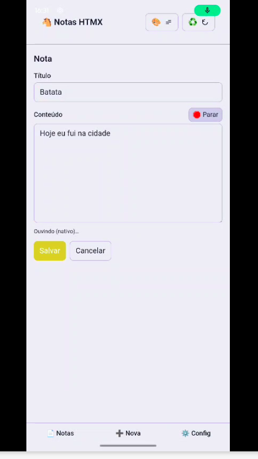
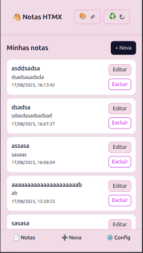

# 🐴 NotasHTMX

Aplicativo simples para criação e gerenciamento de notas, desenvolvido com **Capacitor**, **HTMX** e **Vanilla JS**.  
Compatível com Android como PWA ou app nativo.
Feito pra práticar.

---

## 📸 Pré-visualizações

### Inserção de notas

### Tela inicial

---

## 🚀 Funcionalidades

- Criar, visualizar e editar notas  
- Da pra ditar a nota falando
- Interface minimalista e responsiva  
- Integração com Capacitor para Android  
- Ícone di cavalo 🐴  

---

